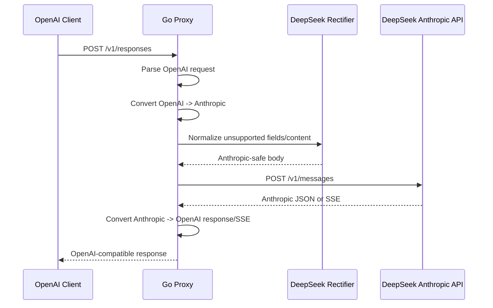

# OpenAI to Anthropic Go Proxy: Existing Project Analysis and Design

Date: 2026-06-12

## 1. Requirement Summary

The target is a privately deployable Go proxy application that accepts OpenAI-compatible requests and forwards them to an Anthropic-compatible upstream. The first target upstream is DeepSeek's official Anthropic-compatible API. The proxy must also normalize requests that do not meet DeepSeek official requirements so that they can be accepted by the upstream.

In practical terms, the application should:

- expose OpenAI-style endpoints for clients, especially `/v1/responses` and `/v1/chat/completions`;
- translate OpenAI request bodies into Anthropic Messages API requests;
- translate Anthropic responses and SSE events back into OpenAI-compatible responses;
- apply DeepSeek-specific rectification before forwarding;
- normalize DeepSeek DS Pro tool-call streaming so clients such as Comate can consume incremental `tool_calls[].function.arguments` deltas;
- run as a small standalone Go service suitable for private deployment.

## 2. Existing Projects

The workspace contains three related but different projects.

### 2.1 `ccswitch`

`ccswitch` is a Go CLI for managing git worktrees. It is unrelated to API proxying.

Useful parts:

- Go project layout, Makefile, Dockerfile, and testing conventions can be used as light references.

Not useful for this requirement:

- It has no LLM protocol translation, proxy forwarding, SSE conversion, provider routing, or DeepSeek logic.

Recommendation:

- Do not build the new proxy inside this project. Reuse only generic Go packaging habits if desired.

### 2.2 `ccswitch-deepseek`

`ccswitch-deepseek` is the closest conceptual reference. It is a Node.js local proxy that accepts OpenAI Responses API requests from Codex CLI and forwards them to DeepSeek Chat Completions.

Current behavior:

- endpoint: `/v1/responses` and `/responses`;
- input conversion: OpenAI Responses API -> DeepSeek Chat Completions;
- output conversion: DeepSeek Chat Completions SSE -> OpenAI Responses SSE;
- supports text messages, function calls, function call outputs, tools, tool choice, streaming, non-streaming, and reasoning content recovery;
- has unit tests for translation logic.

Useful assets:

- `index.js`: minimal HTTP proxy shape, health endpoint, request forwarding, stream/non-stream branching.
- `lib/translate.js`: robust handling for OpenAI Responses `input` items.
- `lib/sse.js`: state machine for emitting OpenAI Responses SSE events.
- `test_translate.js`: good coverage categories for request conversion tests.

Limitations for the new requirement:

- runtime is Node.js, while target runtime is Go;
- translation direction is Responses -> Chat Completions, not Responses -> Anthropic Messages;
- DeepSeek target is Chat Completions, not the official Anthropic-compatible endpoint;
- reasoning recovery is currently global in-memory and not session-scoped;
- no production deployment controls such as structured config, auth, request limits, observability, graceful shutdown, or container-oriented runtime hardening.

Recommendation:

- Treat this as the main behavior reference for OpenAI Responses parsing and OpenAI SSE reconstruction.
- Do not port it line by line. Implement a typed Go converter and a clearer state machine.

### 2.3 `cc-switch`

`cc-switch` is a Tauri desktop application for managing Claude Code, Claude Desktop, Codex, Gemini CLI, OpenCode, OpenClaw, and Hermes providers. It has a mature local proxy subsystem in Rust.

Current proxy capabilities:

- local proxy server, app takeover, provider hot switching, request logs, usage tracking, failover, circuit breaker, and health state;
- format conversion for Claude/Anthropic requests to OpenAI Chat Completions and OpenAI Responses;
- streaming conversion between OpenAI Responses SSE and Anthropic SSE;
- request rectifiers for thinking signatures, thinking budget, media fallback, orphan tool results, and provider-specific quirks;
- DeepSeek-related Anthropic normalization tests, including system-role normalization and thinking block handling for tool history.

Useful assets:

- `src-tauri/src/proxy/providers/transform_responses.rs`: Anthropic -> OpenAI Responses mapping; useful as an inverse-design reference.
- `src-tauri/src/proxy/providers/streaming_responses.rs`: OpenAI Responses SSE -> Anthropic SSE state machine; useful for event taxonomy and response assembly.
- `src-tauri/src/proxy/providers/transform_codex_chat.rs`: Responses -> Chat Completions conversion; useful for OpenAI Responses input semantics and tool handling.
- `src-tauri/src/proxy/thinking_rectifier.rs`, `thinking_budget_rectifier.rs`, `media_sanitizer.rs`, `copilot_optimizer.rs`: useful rectifier patterns.
- `docs/user-manual/zh/4-proxy/4.1-service.md`: documents the existing proxy behavior and supported format conversion ideas.

Limitations for the new requirement:

- it is a desktop application with database, UI, takeover, and provider-management concerns;
- proxy direction is mainly Anthropic client -> upstream provider, while the new app is OpenAI client -> Anthropic upstream;
- implementation language is Rust, not Go;
- the full CC Switch subsystem would be too large for a small private deployment service.

Recommendation:

- Reuse architecture ideas and edge-case rules.
- Build the Go service as a standalone proxy instead of embedding in CC Switch.

## 3. External Protocol Findings

### 3.1 OpenAI-Compatible Input

The proxy should accept two OpenAI-style input surfaces:

- `/v1/responses`: primary target, because Codex-style clients use Responses API semantics such as `input`, `instructions`, `tools`, `tool_choice`, `max_output_tokens`, and named SSE events.
- `/v1/chat/completions`: required for Comate and other OpenAI Chat Completions-compatible coding assistants.

For phase 1, both endpoints should be implemented. `/v1/chat/completions` needs special attention because the urgent DS Pro issue is in Chat Completions streaming tool-call output rather than Responses API output.

### 3.2 Anthropic Messages Output

The upstream request should target Anthropic Messages-compatible API shape:

- `model`
- `messages`
- `system`
- `max_tokens`
- `temperature`
- `top_p`
- `stream`
- `tools`
- `tool_choice`
- `thinking`

Response conversion must support:

- non-streaming Anthropic message response -> OpenAI Responses object;
- streaming Anthropic SSE -> OpenAI Responses SSE lifecycle.

### 3.3 DeepSeek Official Anthropic Compatibility Constraints

DeepSeek's official Anthropic-compatible API is the most important upstream target. The design should assume the proxy forwards to a DeepSeek Anthropic endpoint such as:

```text
https://api.deepseek.com/anthropic
```

Known compatibility implications:

- the Anthropic SDK-style base URL is `https://api.deepseek.com/anthropic`, and the SDK call path resolves to the Messages API path under that base URL;
- Claude model names may be accepted and remapped by DeepSeek, but the proxy should still support explicit model mapping so callers can control `deepseek-v4-pro` versus `deepseek-v4-flash`;
- DeepSeek ignores `anthropic-beta` and `anthropic-version`, so the proxy does not need to forward these headers for correctness;
- `container`, `mcp_servers`, most `metadata`, `service_tier`, and `top_k` are ignored by DeepSeek and should be dropped or left out by default;
- `thinking` is supported, but `budget_tokens` is ignored;
- only `output_config.effort` is supported under `output_config`;
- image, document, search_result, redacted_thinking, code_execution_tool_result, MCP tool use/result, and container_upload content blocks should not be sent to DeepSeek unless support changes;
- unsupported content should be converted to text placeholders or rejected with a clear client error, depending on configuration;
- `system` role messages inside `messages` should be moved into Anthropic's top-level `system` field;
- `max_output_tokens` from OpenAI must become Anthropic `max_tokens`;
- OpenAI tool definitions must become Anthropic `tools[].input_schema`;
- OpenAI function calls must become Anthropic `tool_use` blocks;
- OpenAI function call outputs must become Anthropic `tool_result` blocks;
- OpenAI `reasoning` should map to Anthropic/DeepSeek `thinking` only when enabled and supported;
- Anthropic `thinking` and `redacted_thinking` history may need sanitizing for DeepSeek tool-use histories.

### 3.4 DS Pro Tool-Call Streaming Compatibility

The current internal DS Pro integration shows a client-breaking streaming difference:

- GLM 5.1 returns `chat.completion.chunk` events where `tool_calls[].function.arguments` is emitted as multiple incremental deltas.
- Internal `deepseek-v4-pro` returns the tool call as a mostly complete object in one chunk, including `name` and the full escaped `arguments` string.
- Comate does not support this one-shot tool-call style and expects OpenAI-style incremental tool-call deltas.

This aligns with vLLM PR `vllm-project/vllm#42879`, which fixed DeepSeek V3.2/V4 DSML tool-call streaming by emitting `function.arguments` chunks incrementally after detecting invoke start. The PR was merged on 2026-05-28 and should be included in vLLM `v0.22.0+`.

Design implication:

- The proper platform fix is upgrading internal vLLM to `v0.22.0+` or cherry-picking the PR.
- The proxy must still include a compatibility shim because the platform fix may not be available quickly enough.
- If upstream emits a complete tool call in one streaming chunk, the proxy should split the `function.arguments` string into multiple OpenAI-compatible delta chunks before sending it to the client.
- This shim fixes client format compatibility, but it cannot recover true upstream latency if upstream only sends data after the full tool call is generated.

## 4. Proposed Standalone Go Architecture

### 4.1 Runtime Shape

Create a new standalone Go service, tentatively named `openai-anthropic-proxy`.

Suggested project layout:

```text
openai-anthropic-proxy/
├── cmd/proxy/main.go
├── internal/config/
├── internal/httpserver/
├── internal/openai/
├── internal/anthropic/
├── internal/convert/
├── internal/rectifier/
├── internal/upstream/
├── internal/sse/
├── internal/logging/
├── internal/usage/
├── Dockerfile
├── docker-compose.yml
├── go.mod
└── README.md
```

### 4.2 Request Flow



The exact upstream path should be configurable because some providers expect `/v1/messages`, some expect `/anthropic/v1/messages`, and DeepSeek-style base URLs may already include `/anthropic`.

### 4.3 Core Components

#### Config

Load from environment variables and optionally a YAML/TOML file.

Minimum fields:

- `LISTEN_ADDR`, default `127.0.0.1:11435`
- `UPSTREAM_BASE_URL`, default `https://api.deepseek.com/anthropic`
- `UPSTREAM_API_KEY`
- `DEFAULT_MODEL`
- `MODEL_MAP`, optional JSON map from OpenAI model names to DeepSeek model names
- `ENABLE_CHAT_COMPLETIONS`, default `true`
- `TOOL_CALL_STREAM_SHIM`, default `true`
- `TOOL_CALL_ARGUMENT_CHUNK_SIZE`, default `16`
- `MEDIA_MODE`, one of `placeholder`, `reject`, `drop`
- `LOG_LEVEL`
- `REQUEST_TIMEOUT_SECONDS`

#### HTTP Server

Endpoints:

- `GET /health`
- `GET /v1/models` returns configured/model-mapped model list or proxies upstream if enabled
- `POST /v1/responses`
- `POST /responses` alias
- `POST /v1/chat/completions`

#### OpenAI Parser

Responsibilities:

- parse Responses `input` in string, object, and array forms;
- parse `message`, `function_call`, `function_call_output`, and reasoning items;
- parse OpenAI tools, custom tools where possible, and tool choice;
- preserve enough metadata to reconstruct OpenAI-compatible outputs.

#### Anthropic Builder

Responsibilities:

- build top-level `system` from OpenAI `instructions` and any system/developer messages;
- build `messages` as Anthropic user/assistant turns;
- map OpenAI function calls and outputs to `tool_use` and `tool_result`;
- map `max_output_tokens` to `max_tokens`;
- map `reasoning` or `thinking` into Anthropic `thinking` when enabled;
- map model through configured aliases.

#### DeepSeek Rectifier

Responsibilities:

- remove or replace unsupported `image`, `document`, `input_audio`, `input_file`, MCP, and unknown content blocks;
- normalize system-role messages into top-level `system`;
- remove unsupported beta headers unless configured;
- strip or rewrite `redacted_thinking`;
- drop or omit fields DeepSeek documents as ignored unless `STRICT_PASSTHROUGH=true`;
- preserve supported DeepSeek fields: `max_tokens`, `stop_sequences`, `stream`, `system`, `temperature`, `thinking`, `top_p`, tools, and `tool_choice`;
- remove Anthropic `thinking.signature` fields when the upstream rejects or cannot verify them;
- ensure tool results are adjacent to the tool use they answer where possible;
- validate tool schemas and remove unsupported schema keywords if needed.

Rectification should report what changed in structured logs and optional response metadata.

#### Upstream Client

Responsibilities:

- build target URL safely from `UPSTREAM_BASE_URL`;
- set headers:
  - `Authorization: Bearer <UPSTREAM_API_KEY>`
  - `Content-Type: application/json`
  - `Accept: text/event-stream` for streaming
  - `anthropic-version` if required by upstream
- stream without buffering full responses;
- map upstream errors into OpenAI-style error envelopes.

#### SSE Translators

Three state machines are needed:

- Anthropic SSE -> OpenAI Responses SSE.
- Anthropic SSE -> OpenAI Chat Completions chunks.
- OpenAI Chat Completions SSE normalizer for DS Pro/vLLM one-shot tool-call chunks.

For `/v1/responses`, the translator should emit:

- `response.created`
- `response.in_progress`
- `response.output_item.added`
- `response.content_part.added`
- `response.output_text.delta`
- `response.function_call_arguments.delta`
- `response.output_text.done`
- `response.function_call_arguments.done`
- `response.output_item.done`
- `response.completed`

For `/v1/chat/completions`, the translator and normalizer should emit OpenAI-compatible chunks:

- first tool chunk: include `id`, `index`, `type: "function"`, and `function.name` when available;
- argument chunks: include only `index` and `function.arguments` delta fragments;
- final chunk: preserve `finish_reason: "tool_calls"`;
- usage chunk: preserve upstream usage when available.

## 5. Conversion Design

### 5.1 OpenAI Responses Request -> Anthropic Messages Request

Mapping:

| OpenAI Responses | Anthropic Messages |
|---|---|
| `model` | `model` after model map |
| `instructions` | top-level `system` |
| `input` user message text | `messages[].content[].text` |
| `input_text` | `text` block |
| `output_text` in history | assistant `text` block |
| `function_call` | assistant `tool_use` block |
| `function_call_output` | user `tool_result` block |
| `tools[].type=function` | `tools[].name`, `description`, `input_schema` |
| `tool_choice="auto"` | `tool_choice={"type":"auto"}` or omitted |
| `tool_choice="required"` | `tool_choice={"type":"any"}` |
| `tool_choice={type:function,name}` | `tool_choice={"type":"tool","name":...}` |
| `max_output_tokens` | `max_tokens` |
| `reasoning.effort` | `thinking` policy, if enabled |
| `stream` | `stream` |

OpenAI Responses input is not always a clean alternating chat transcript. The converter should preserve order but may need to coalesce adjacent same-role messages to satisfy Anthropic's expectations.

### 5.2 Anthropic Message Response -> OpenAI Responses Response

Mapping:

| Anthropic Response | OpenAI Responses |
|---|---|
| message id | response id |
| `content[].text` | output item `message` with `output_text` |
| `content[].tool_use` | output item `function_call` |
| `usage.input_tokens` | `usage.input_tokens` |
| `usage.output_tokens` | `usage.output_tokens` |
| `stop_reason=tool_use` | completed response with function call item |
| `stop_reason=max_tokens` | `status=incomplete` or completed with incomplete details depending on client compatibility |

### 5.3 OpenAI Chat Completions Compatibility

Map Chat Completions into the same internal normalized conversation model:

- `messages[].role=system/developer` -> top-level `system`;
- `messages[].role=user` -> Anthropic user content;
- `messages[].role=assistant` with `tool_calls` -> Anthropic assistant `tool_use`;
- `messages[].role=tool` -> Anthropic user `tool_result`;
- `max_tokens` or `max_completion_tokens` -> Anthropic `max_tokens`.

This path is required for Comate compatibility.

### 5.4 Chat Completions Tool-Call Streaming Normalization

When the selected upstream is OpenAI Chat Completions-compatible and emits streaming chunks directly, the proxy should normalize tool-call chunks before returning them to Comate.

Input pattern to detect:

```json
{
  "choices": [{
    "index": 0,
    "delta": {
      "content": null,
      "tool_calls": [{
        "index": 0,
        "id": "call_xxx",
        "type": "function",
        "function": {
          "name": "get_weather",
          "arguments": "{\"city\":\"北京\"}"
        }
      }]
    },
    "finish_reason": null
  }]
}
```

Output pattern to emit:

```json
{"choices":[{"index":0,"delta":{"tool_calls":[{"index":0,"id":"call_xxx","type":"function","function":{"name":"get_weather","arguments":""}}]},"finish_reason":null}]}
{"choices":[{"index":0,"delta":{"tool_calls":[{"index":0,"function":{"arguments":"{\"city\""}}]},"finish_reason":null}]}
{"choices":[{"index":0,"delta":{"tool_calls":[{"index":0,"function":{"arguments":":\"北京\"}"}}]},"finish_reason":null}]}
{"choices":[{"index":0,"delta":{},"finish_reason":"tool_calls"}]}
```

Rules:

- preserve the original chunk `id`, `object`, `created`, `model`, and choice `index`;
- emit the tool id/type/name only once per tool-call index;
- split `function.arguments` on UTF-8-safe boundaries;
- never parse and reserialize the arguments string unless it is already invalid and the chosen compatibility mode allows repair;
- preserve `reasoning_content` and normal text deltas in their original order;
- pass through already-incremental tool-call streams unchanged;
- log when a one-shot tool call is normalized.

## 6. Deployment Design

The service should support:

- single static Go binary;
- Docker image;
- docker-compose sample;
- graceful shutdown;
- request body size limits;
- read/write/idle timeouts;
- structured JSON logs;
- optional bearer token for inbound clients, e.g. `PROXY_API_KEY`;
- no persistent database in phase 1.

Recommended default ports:

- `127.0.0.1:11435` for local deployment;
- allow `0.0.0.0:11435` only when explicitly configured.

## 7. Testing Strategy

Unit tests:

- Responses input parsing;
- Responses -> Anthropic conversion;
- Chat Completions -> Anthropic conversion;
- tool conversion;
- DeepSeek rectifier transformations;
- Anthropic response -> Responses response;
- one-shot Chat Completions tool-call chunk -> incremental chunks;
- already-incremental Chat Completions tool-call chunks pass through unchanged;
- SSE state machine using fixture streams.

Golden fixtures:

- simple text request;
- system/developer instructions;
- tool call + tool result loop;
- streaming text;
- streaming tool use;
- DS Pro one-shot `tool_calls[].function.arguments`;
- GLM-style incremental `tool_calls[].function.arguments`;
- reasoning/thinking enabled;
- unsupported image/document input;
- invalid/orphan tool result.

Integration tests:

- local fake Anthropic upstream;
- local fake OpenAI Chat Completions upstream that returns a DS Pro-style one-shot tool call;
- proxy returns OpenAI Responses JSON;
- proxy returns OpenAI Responses SSE;
- proxy returns Comate-compatible Chat Completions SSE for one-shot tool calls;
- upstream error becomes OpenAI-style error;
- timeout and cancellation behavior.

## 8. Recommended Implementation Phases

### Phase 1: Minimal Responses Proxy

- Go service skeleton.
- `/health`, `/v1/responses`, `/responses`, `/v1/chat/completions`.
- OpenAI Responses text/tool input -> Anthropic.
- Chat Completions text/tool input -> Anthropic.
- Anthropic non-stream and stream -> OpenAI Responses.
- Anthropic or upstream Chat Completions stream -> OpenAI Chat Completions.
- DS Pro one-shot tool-call stream normalizer for Comate.
- DeepSeek rectifier for system, media, thinking signature, and unknown blocks.
- Dockerfile and README.

### Phase 2: Broader Compatibility

- More OpenAI parameter compatibility.
- Additional provider-specific stream normalizers.
- Optional passthrough mode for already-correct OpenAI-compatible upstreams.

### Phase 3: Production Hardening

- inbound auth;
- model list endpoint;
- metrics endpoint;
- model alias config;
- richer structured logs;
- retry policy for idempotent upstream failures;
- optional failover provider list.

## 9. Open Questions

1. Should unsupported media be replaced with text placeholders, rejected with 400, or silently dropped?
2. Is DeepSeek the only upstream target, or should the design support generic Anthropic-compatible providers from day one?
3. Should the proxy expose an OpenAI-compatible `/v1/models` endpoint backed by static config or upstream discovery?
4. Do you need inbound authentication for private deployment, or is network isolation enough?
5. For Comate, what minimum `function.arguments` chunk size/timing is known to work best?

## 10. Recommendation

Use a standalone Go service. Keep the scope narrower than CC Switch and more production-oriented than `ccswitch-deepseek`.

Recommended phase 1 scope:

- OpenAI Responses API in;
- OpenAI Chat Completions API in;
- DeepSeek Anthropic API out;
- streaming and non-streaming support;
- tools and tool results;
- Comate-compatible Chat Completions tool-call stream normalization;
- strict DeepSeek rectification;
- Docker/private deployment support.

This gives the exact bridge needed for Codex/OpenAI-style clients while avoiding the complexity of a full provider management desktop application.

## 11. Source Links

- DeepSeek Anthropic API compatibility: https://api-docs.deepseek.com/guides/anthropic_api
- DeepSeek Chat Completion reference, useful for current model/tool/thinking behavior: https://api-docs.deepseek.com/api/create-chat-completion
- Anthropic Messages API reference: https://docs.anthropic.com/en/api/messages
- OpenAI Responses API reference: https://platform.openai.com/docs/api-reference/responses/create
- vLLM DeepSeek DSML tool-call streaming fix: https://github.com/vllm-project/vllm/pull/42879
- vLLM releases, confirming v0.22.0+ availability: https://github.com/vllm-project/vllm/releases
